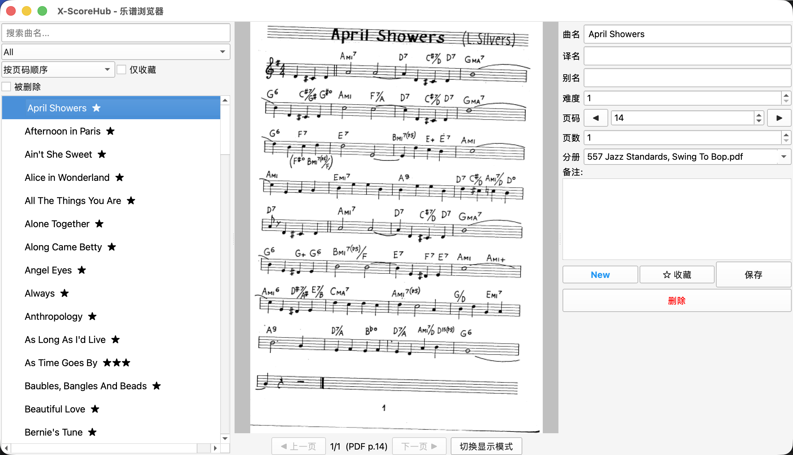

# X-ScoreHub

**Jazz 乐谱浏览与管理桌面应用**

基于 PyQt5 + SQLite + PyMuPDF，支持多分册 PDF 乐谱的检索、预览、编辑和收藏。专为 Jazz 乐手设计 —— 单首曲目快速查找、大屏双页读谱、触控板缩放翻页。



## 当前状态 (v1.1)

- **11566 首曲目**，覆盖 **10 个 PDF 分册**
- **双页全屏显示** (`Ctrl+Cmd+F`) —— 隐藏侧栏，两张乐谱并排
- **触控板双指缩放** —— macOS 原生手势，流畅缩放平移
- 完整 CRUD + 软删除/恢复 + 收藏 + 批量操作
- Markdown 导入/导出
- 预置数据可直接使用；也欢迎提 PR 补充曲目和分册

## 功能亮点

### 乐谱浏览
- 三栏布局：曲目列表 | PDF 显示区 | 信息编辑面板
- 搜索支持 `*` 通配符，中/英文曲名 + 别名实时过滤
- 按分册、难度、收藏状态筛选，按页码 / 录入顺序 / 难度排序
- 列表懒加载，万首曲目秒开，无卡顿

### PDF 渲染与交互
- PyMuPDF 200 DPI 高清渲染，自适应窗口大小
- **滚轮缩放** (1× ~ 8×)，以鼠标为中心
- **双指缩放** (macOS 触控板)，平滑跟手，松手锁定
- 缩放后拖拽平移 (OpenHand Cursor)
- 多页乐曲翻页：按钮 / 键盘 `←` `→` / 右键面板 ◀▶

### 全屏乐谱模式 (`Ctrl+Cmd+F`)
- 侧边栏隐藏，乐谱区占满整个窗口
- **双页并排显示**，中间留缝隙，翻页每次步进 1 页
- 单页歌曲自动居中显示
- 乐谱区底部「切换显示模式」按钮一键触发

### 曲目管理
- 可编辑字段：曲名、译名、别名、难度 (1–9)、页码、占用页数、分册、备注
- **收藏 ★** / **软删除** / 恢复 / 彻底删除
- **批量操作**：多选后批量删除、恢复、彻底删除
- 手动新增 (`Ctrl+N`) / 导入 (Markdown 表格) / 导出选中 (`Ctrl+E`)

## 快捷键速查

| 按键 | 功能 |
|------|------|
| `Ctrl+Cmd+F` | 全屏乐谱双页模式 |
| `Cmd+F` | 聚焦搜索框 |
| `←` `→` | PDF 前后翻页 |
| `Ctrl+N` | 新增曲目 |
| `Ctrl+E` | 导出选中曲目 |
| `ESC` | 退出系统全屏窗口 |
| 滚轮 | PDF 缩放 (1× ~ 8×) |
| 双指捏合 | 触控板缩放 |
| 拖拽 | 缩放后平移画面 |

## 快速开始

### 环境要求
- Python 3.10+
- macOS / Windows / Linux
- 至少一个 PDF 分册放在 `pdf_repo/` 下

### 开发运行

```bash
git clone https://github.com/<your-account>/X-ScoreHub.git
cd X-ScoreHub
python3 -m venv .venv
source .venv/bin/activate
pip install -r requirements.txt
python main.py
```

### macOS 打包安装

```bash
source .venv/bin/activate
pip install pyinstaller
pyinstaller X-ScoreHub.spec
# dist/X-ScoreHub.app 直接拖入 /Applications
```

`dist/` 目录也提供预构建 DMG：
- `X-ScoreHub-jazz.dmg` (~217 MB) — 8 本 Jazz 分册
- `X-ScoreHub-full.dmg` (~4.2 GB) — 全部 10 本（含简谱、乐队总谱）

## 项目结构

```
X-ScoreHub/
├── main.py                     # 入口：初始化 DB、图标、样式、启动主窗口
├── X-ScoreHub.spec             # PyInstaller 打包配置
├── X-ScoreHub.icns             # macOS 应用图标
├── app/
│   ├── utils.py                # 路径兼容 (dev / PyInstaller frozen)
│   ├── database.py             # SQLite 数据层
│   ├── importers.py            # Markdown 导入（智能分册名匹配、增量导入）
│   ├── exporters.py            # Markdown 导出
│   ├── main_window.py          # 主窗口（三栏 Splitter + 键盘/手势路由）
│   └── widgets/
│       ├── song_list.py        # 左栏 — 搜索/筛选/排序/批量操作/懒加载
│       ├── pdf_viewer.py       # 中栏 — ScoreCanvas + DualScoreCanvas
│       └── song_info.py        # 右栏 — 信息编辑/收藏/删除/页码预览
├── apply_ocr_results.py        # OCR 结果纠偏
├── pdf_repo/                   # PDF 乐谱分册 (不纳入 Git)
├── import-md/                  # 导入数据源
├── scores.db                   # SQLite 数据库
└── requirements.txt
```

## 数据库

```sql
CREATE TABLE songs (
    id INTEGER PRIMARY KEY AUTOINCREMENT,
    sequence INTEGER,
    name TEXT NOT NULL,          -- 曲名
    name_cn TEXT DEFAULT '',     -- 中文译名
    alias TEXT DEFAULT '',       -- 别名
    difficulty INTEGER DEFAULT 0,
    pdf_start_page INTEGER NOT NULL,
    pdf_pages INTEGER NOT NULL DEFAULT 1,
    volume TEXT NOT NULL,        -- 所属分册文件名
    notes TEXT DEFAULT '',
    favorite INTEGER DEFAULT 0,
    deleted INTEGER DEFAULT 0,
    created_at TIMESTAMP DEFAULT CURRENT_TIMESTAMP
);
```

## 可用分册

| 文件名 | 大小 | 说明 |
|--------|------|------|
| `557 Jazz Standards, Swing To Bop.pdf` | 36 MB | 557 首 Jazz Standards |
| `The New Real Book Vol.1.pdf` | 19 MB | NRB 第 1 卷 |
| `The New Real Book Vol.2.pdf` | 18 MB | NRB 第 2 卷 |
| `The New Real Book Vol.3.pdf` | 18 MB | NRB 第 3 卷 |
| `The Real Book Of Blues (225 Songs).pdf` | 29 MB | 225 首 Blues |
| `The-Real-Book-6th-Edition-Eb.pdf` | 14 MB | Real Book Eb 版 |
| `The Rea Easy Book Vol.1` | 16 MB | 初级即兴入门 (C) |
| `The Rea Easy Book Vol.2` | 25 MB | 中级即兴 (C) |
| `乐队总谱合集.pdf` | 1.8 GB | 乐队总谱 |
| `简谱合集.pdf` | 2.6 GB | 简谱 |

> PDF 版权属原出版社所有，请合法使用。本项目不分发 PDF 文件。

## 贡献

欢迎提交 PR！主要方向：
- 补充曲目数据和 OCR 校对
- 功能增强（集锦 / 练习记录 / 转调 / 音频关联等）
- Bug 修复和跨平台兼容

导入格式详见 [IMPORT_SONG_FORMAT.md](IMPORT_SONG_FORMAT.md)。

## 许可

Apache License 2.0 — 详见 [LICENSE](LICENSE)
